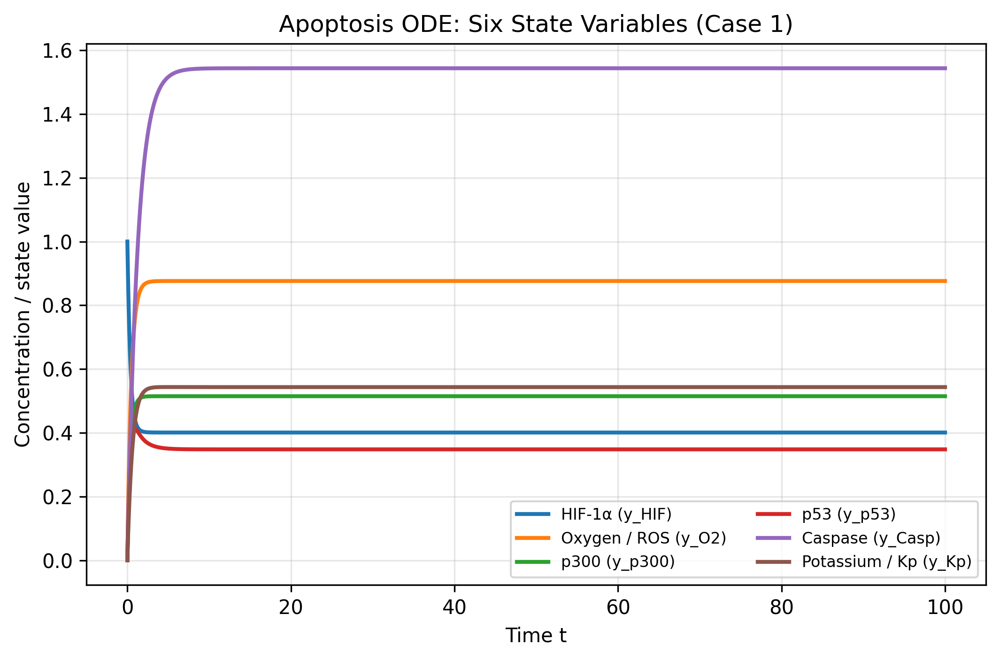
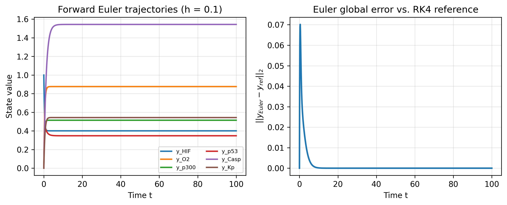
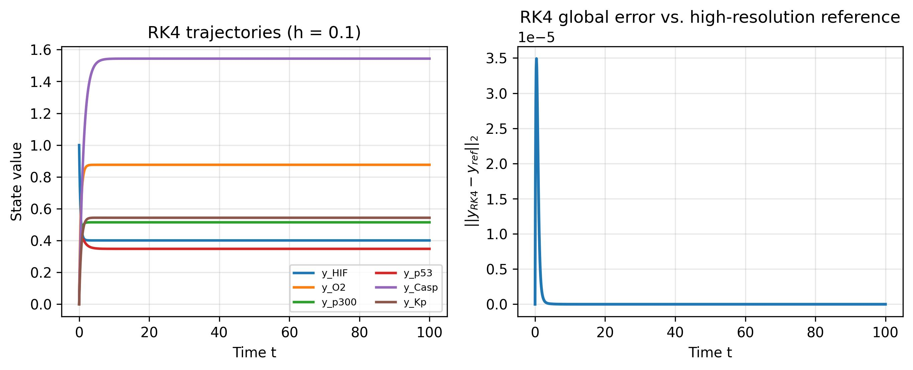
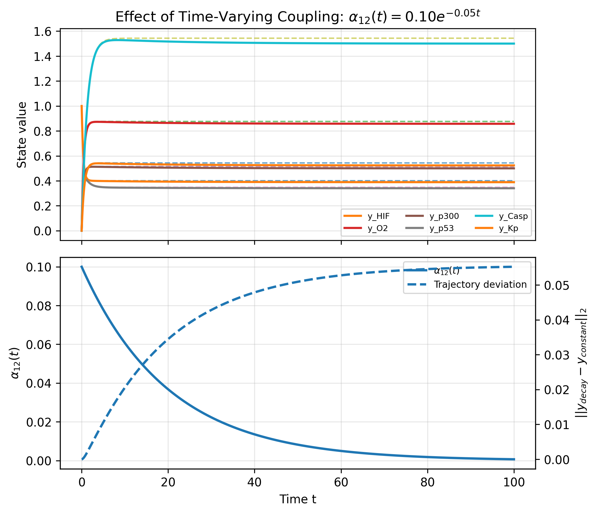
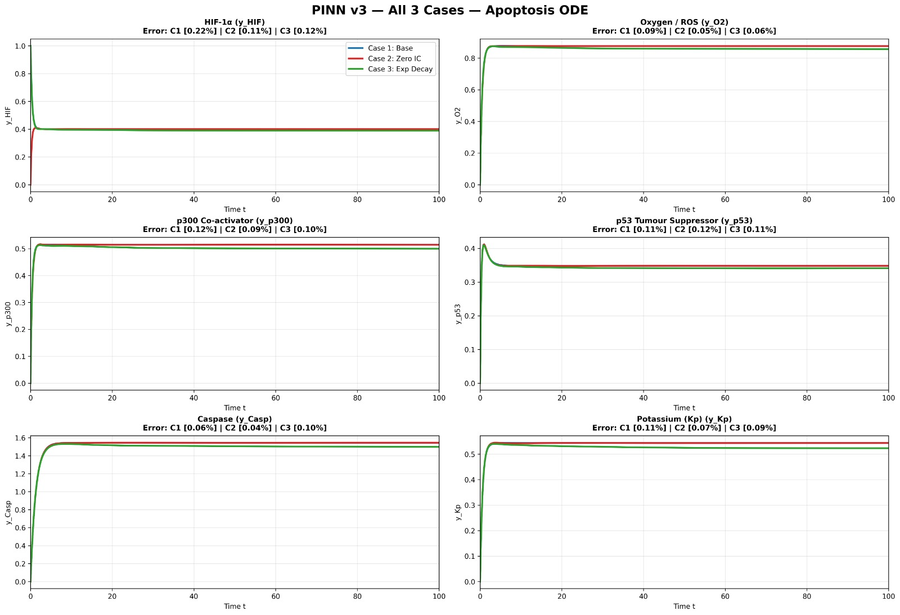
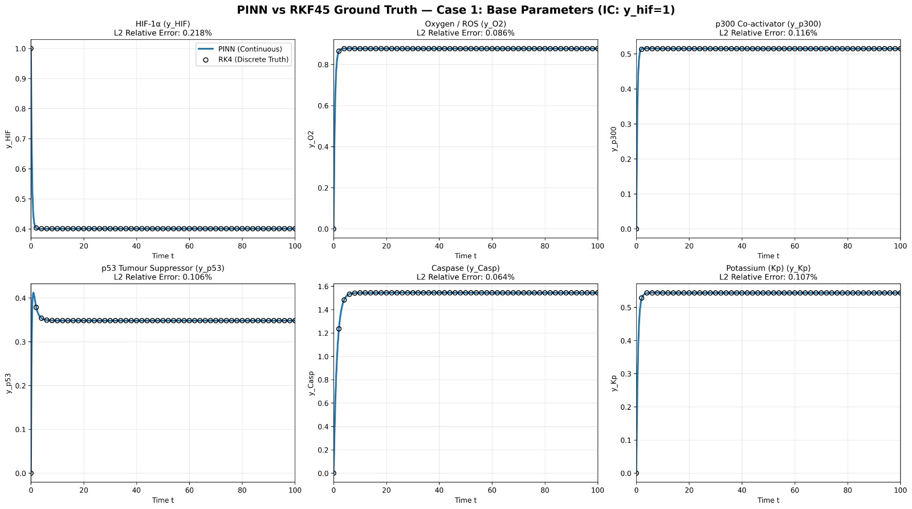
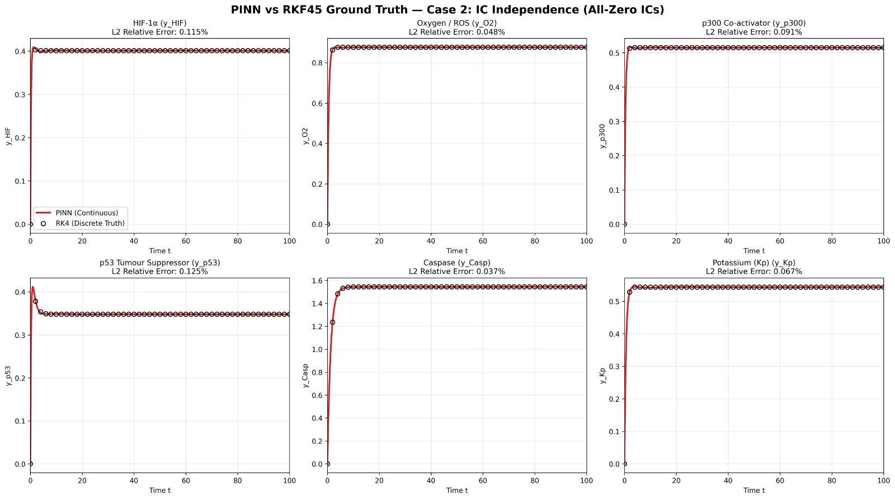
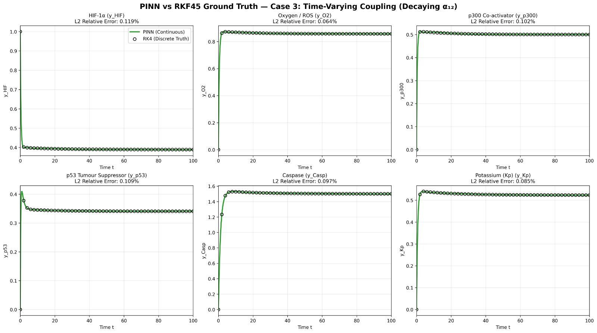

# Numerical and Machine Learning Methods for Solving Apoptosis ODEs

A computational biology project comparing classical numerical solvers (Forward Euler, RK4) against a Physics-Informed Neural Network (PINN) for a six-variable nonlinear ODE model of the apoptosis (programmed cell death) pathway.

**Department of Systems and Biomedical Engineering, Faculty of Engineering, Cairo University**

**Authors:** Dana Hamed, Habiba Ibrahim, Rana Hesham, Menna Ashraf, Nour Ahmed, David Bahaa, Ebrahim Nasser, Filopatir Emad, Yahya Ismail, Youssef El Roby, Youssef Hisham

---

## Overview

Apoptosis is a regulated form of programmed cell death central to tissue homeostasis, development, immune regulation, and the elimination of damaged cells. This project models the apoptosis cascade with a six-variable nonlinear ODE system (based on Schiesser's biomedical ODE framework) and solves it three ways:

1. **Forward Euler** — first-order, simple, fast per step.
2. **RK4 (Runge-Kutta 4th order)** — higher accuracy, used as the ground-truth reference.
3. **Physics-Informed Neural Network (PINN)** — a continuous, differentiable surrogate trained to satisfy the ODE residual and initial conditions.

Three experimental cases are evaluated: a base case, an all-zero initial-condition case, and a time-varying coupling case.

## The Model

State vector:

```
y = [y_hif, y_o2, y_p300, y_p53, y_casp, y_kp]ᵀ
```

representing HIF-1α, oxygen/ROS, the p300 co-activator, the p53 tumor suppressor, caspase, and potassium-related signaling.

Governing equations:

```
dy_hif/dt  = a_hif - a3·y_o2·y_hif - a4·y_hif·y_p300 - a7·y_p53·y_hif
dy_o2/dt   = a_o2 - a3·y_o2·y_hif + a4·y_hif·y_p300 - a11·y_o2
dy_p300/dt = a8 - a4·y_hif·y_p300 - a5·y_p300·y_p53
dy_p53/dt  = a_p53 - a5·y_p300·y_p53 - a9·y_p53
dy_casp/dt = a12(t) + a9·y_p53 - a13·y_casp
dy_kp/dt   = -a10·y_casp·y_kp + a11·y_o2 - a14·y_kp
```

Parameter values are taken from Table 3.3 of Schiesser's *Differential Equation Analysis in Biomedical Science and Engineering*.

| Parameter | Value | Parameter | Value |
|-----------|-------|-----------|-------|
| a_hif | 1.52 | a8  | 0.06 |
| a_o2  | 1.80 | a9  | 0.10 |
| a_p53 | 0.05 | a10 | 0.70 |
| a3    | 0.90 | a11 | 0.20 |
| a4    | 0.20 | a12 | 0.10 |
| a5    | 0.001| a13 | 0.10 |
| a7    | 0.70 | a14 | 0.05 |

## Methods

### Forward Euler
```
y_(n+1) = y_n + h·f(t_n, y_n)
```
First-order accurate; simple and cheap per step but accumulates larger error.

### RK4
```
y_(n+1) = y_n + (h/6)·(k1 + 2k2 + 2k3 + k4)
```
Fourth-order accurate; used as the ground-truth reference against which Euler and the PINN are evaluated.

### Physics-Informed Neural Network (PINN)
- Architecture: 1 input neuron (time) → 6 hidden layers × 128 neurons (Tanh activations) → 6 output neurons (state variables).
- Case 1 uses a Softplus final activation to keep concentrations non-negative.
- Loss combines the ODE residual and the initial-condition loss: `L_total = w_ode·L_ode + w_ic·L_ic`, with `w_ic = 1000` to strongly enforce initial conditions.
- Trained with Adam followed by L-BFGS refinement.

## Experimental Cases

| Case | Initial Condition | Coupling α₁₂ |
|------|-------------------|--------------|
| 1 — Base | y(0) = [1, 0, 0, 0, 0, 0] | Constant, 0.10 |
| 2 — Zero IC | y(0) = [0, 0, 0, 0, 0, 0] | Constant, 0.10 |
| 3 — Time-varying | y(0) = [1, 0, 0, 0, 0, 0] | α₁₂(t) = 0.10·e^(−0.1t) |

## Results

At step size h = 0.1:

| Solver | RMSE |
|--------|------|
| Forward Euler | 0.000644 |
| RK4 | 0.0000150 |

RK4 is far more accurate and remains stable under the time-varying coupling of Case 3, where Euler accumulates larger error.

**PINN relative L2 error vs. RK4 ground truth:**

| Variable | Case 1 | Case 2 | Case 3 |
|----------|--------|--------|--------|
| y_hif  | 0.218% | 0.115% | 0.119% |
| y_o2   | 0.086% | 0.048% | 0.064% |
| y_p300 | 0.116% | 0.091% | 0.102% |
| y_p53  | 0.106% | 0.125% | 0.109% |
| y_casp | 0.064% | 0.037% | 0.097% |
| y_kp   | 0.107% | 0.067% | 0.085% |

The PINN closely tracks RK4 across all variables and cases, with the smallest error for caspase in Case 2 (0.037%) and the largest for HIF-1α in Case 1 (0.218%). Unlike Euler/RK4, the PINN produces a continuous, differentiable solution that can be evaluated at any time point in the training interval — useful for interpolation and future parameter estimation — but it requires an upfront training phase, so RK4 remains the simpler, more efficient choice for a single direct simulation.

## Figures

**Figure 1 — Six-variable ODE trajectories, Case 1**
System evolution: HIF-1α decreases from its initial value while oxygen/ROS, p300, caspase, and potassium-related variables rise toward steady state.



**Figure 2 — Forward Euler: trajectories and global error vs. RK4**



**Figure 3 — RK4: trajectories and global error vs. high-resolution reference**



**Figure 4 — Effect of exponentially decaying coupling, α₁₂(t) = 0.10·e^(−0.05t)**



**Figure 5 — PINN predictions across all three cases, all six state variables**



**Figure 6 — Case 1: PINN vs. RK4/RKF45 ground truth**



**Figure 7 — Case 2: PINN vs. ground truth (all-zero initial conditions)**



**Figure 8 — Case 3: PINN vs. ground truth (time-varying coupling)**



## Conclusion

RK4 is the most reliable classical solver for direct simulation of the apoptosis ODE system, offering much better accuracy and stability than Forward Euler — especially as the coupling parameter varies with time. The PINN successfully learns a continuous approximation of the apoptosis trajectories while respecting the governing physics, achieving low relative L2 error against RK4 across all tested cases. This makes PINNs a promising surrogate-modeling approach for interpolation, visualization, and future inverse/parameter-estimation work, while RK4 remains the more efficient tool for a single direct simulation.

## Future Work

- Extend the model with more detailed apoptosis regulators (BAX, Bcl-2, mitochondrial cytochrome c release) and crosstalk with necroptosis/pyroptosis.
- Couple the ODE model with tissue-level simulations to study effects on tissue rigidity and organization.
- Use the PINN for inverse modeling to estimate unknown biological parameters from experimental data.

## References

1. E. Kutumova, I. Akberdin, I. Lavrik, and F. Kolpakov, "Mathematical Modeling of Cell Death and Survival: Toward an Integrated Computational Framework for Multi-Decision Regulatory Dynamics," *Cells*, vol. 14, no. 22, p. 1792, 2025.
2. P. Burt, R. Cornelis, G. Geißler, S. Hahne, A. Radbruch, H.-D. Chang, and K. Thurley, "Data-Driven Mathematical Model of Apoptosis Regulation in Memory Plasma Cells," *Cells*, vol. 11, no. 9, p. 1547, 2022.
3. K. Schorpp, A. Bessadok, A. Biibosunov, I. Rothenaigner, S. Strasser, T. Peng, and K. Hadian, "CellDeathPred: a deep learning framework for ferroptosis and apoptosis prediction based on cell painting," *Cell Death Discovery*, vol. 9, p. 277, 2023.
4. S. Kari, K. Subramanian, I. A. Altomonte, A. Murugesan, O. Yli-Harja, and M. Kandhavelu, "Programmed cell death detection methods: a systematic review and a categorical comparison," *Apoptosis*, vol. 27, pp. 482–508, 2022.
5. G. A. Reddy and P. Katira, "Differences in Cell Death and Division Rules Can Alter Tissue Rigidity and Fluidization," *Soft Matter*, 2022, doi: 10.1039/D2SM00174H.
6. Y. Tang, S. Chen, M. J. Bowick, and D. Bi, "Cell Division and Motility Enable Hexatic Order in Biological Tissues," *Physical Review Letters*, 2024.
7. W. E. Schiesser, *Differential Equation Analysis in Biomedical Science and Engineering: Ordinary Differential Equations with R*. John Wiley & Sons, 2014.

---

## Repository Structure

```
.
├── README.md
└── figures/
    ├── fig1_case1_trajectories.png
    ├── fig2_euler_trajectories_error.jpeg
    ├── fig3_rk4_trajectories_error.jpeg
    ├── fig4_time_varying_coupling.png
    ├── fig5_pinn_all_cases.png
    ├── fig6_pinn_vs_rk4_case1.png
    ├── fig7_pinn_vs_rk4_case2.png
    └── fig8_pinn_vs_rk4_case3.png
```

> Add your solver scripts / notebooks (Euler, RK4, PINN) alongside this README and update the structure above accordingly.
